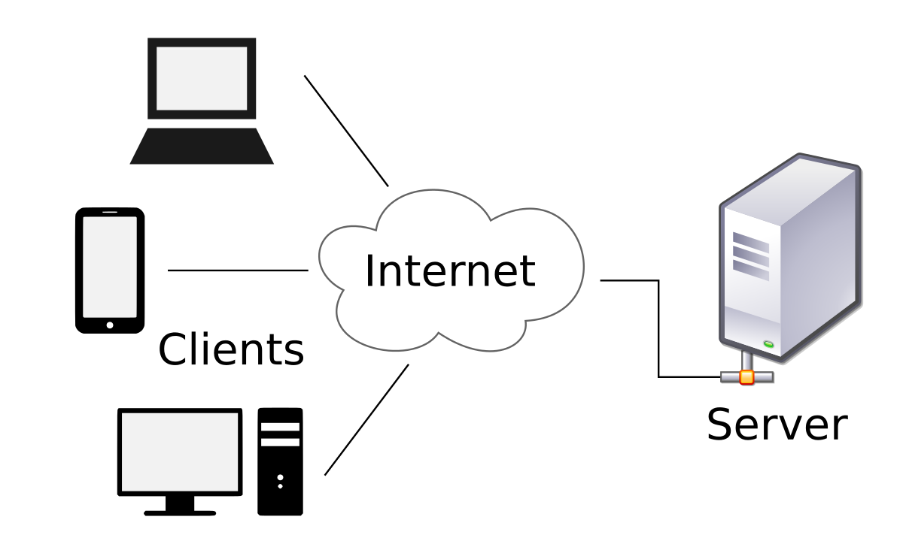

# How to work with and build APIs

### Before we get started...

* Install Node JS @ v8.4.0 https://nodejs.org/
* Install Google Chrome https://www.google.com/chrome/browser/
* Install Postman from the Google Chrome Store https://goo.gl/VZ1xD2

# How to work with and build APIs

---

## About me

* @ericmasiello
* eric.j.masiello@gmail.com
* Fullstack JavaScript Engineer @ Vistaprint Digital
* General Assembly instructor for FEWD and Workshops
* Co-Author of Mastering React Native

--

### Buy Me :)

[](https://www.amazon.com/gp/product/1785885782/ref=as_li_tl?ie=UTF8&camp=1789&creative=9325&creativeASIN=1785885782&linkCode=as2&tag=ericmasiello-20&linkId=0b797f6960a050d6567fd26505307fec)

---

## Agenda

1. Overview of APIs & REST
2. Data over Web APIs
3. Clients, Servers, and HTTP
4. Planning an API with our mock app

---

## What's an API?

* Application Programming Interface
* Defines how others can access and update information from your program
* APIs expose data and functionality that are usable by other programs while keeping some data & code private

***This* data is public and *this* is how you access it**

--

## Public APIs vs. Private APIs
* Not all information is avaialble to the public
* May require you pay money for access
* May require special permission (e.g. user must be an admin or an employee of the company)

Note:
* Think Facebook.
* Some data is available to everyone if you sign up to use their API. 
* But there's lots of private data in there that's not accessible to just anyone

--

## What's a Web API?
* Very popular form of API
* Accessed by URLs with various HTTP methods (Endpoints)
* Allows companies to expose data for use by other 3rd parties

Popular examples: Yelp, Facebook, Google Maps

--

### Endpoints
Web APIs are accessible via "endpoints" 
* Composed of a path `http://website.com`**`/api/users/`**<br/><br/>
* And an HTTP verb: `GET`, `PUT` or `PATCH`, `POST`, `DELETE`<br/><br/>

Example endpoints for **`users`**:

```plain
GET     /api/users
GET     /api/users/{userId}
PUT     /api/users/{userId}
POST    /api/users
DELETE  /api/users/{userId}
```

Note:
* Where have you seen "http" before?

--

### But what does all this mean?

Note:
* We can infer that we're likely dealing with "users" based on the endpoint
* But what's a GET vs. a POST vs. DELETE, etc?

--

### REST
**RE**presentational **S**tate **T**ransfer
* A convention for how to predictably compose endpoints
* An API is said to be **REST**ful if it follows these conventions

--

### Example REST Conventions for `users`

```plain
GET     /api/users            Return list of all users
GET     /api/users/123        Return a user with ID 123
PUT     /api/users/123        Update user with ID 123
POST    /api/users            Create a brand new user
DELETE  /api/users/123        Delete user with ID 123
```

--

### Tie it all together

* An API is a way to expose and consume data from users
* A Web API is made up of endpoints
* Endpoints are composed of a web path and an HTTP verb
* REST defines conventions for how to configure endpoints

---

## But what about the data?

--

### JSON

JavaScript Object Notation

* Most common way respresenting data in APIs
* Does **NOT** require JavaScript
* Composed of a series of key/value pairs
```plain
  {
    "firstName": "Eric",
    "lastName": "Masiello",
    "email": "eric.j.masiello@gmail.com",
    "yearsTeaching": 3,
    "isActive": true
  }
```
Keys are on the left, values on the right

--

### JSON Syntax

* Each entity (object) is wrapped in a `{` ... `}`
* Keys are always wrapped in double quotes
* Keys and values are separated by a colon
* Every value, *except the last*, should be followed by a comma
* String values are wrapped in double quotes
* Numbers and booleans values are not wrapped in double quotes

```plain
  {
    "firstName": "Eric",
    "lastName": "Masiello",
    "email": "eric.j.masiello@gmail.com",
    "yearsTeaching": 3,
    "isActive": true
  }
```

--

### Returning Multiple of JSON Records
Use square brackets to represent a list of records
```plain
  [
    {
      "firstName": "Eric",
      "lastName": "Masiello",
      "email": "eric.j.masiello@gmail.com",
      "yearsTeaching": 3,
      "isActive": true
    },
    {
      "firstName": "Eric",
      "lastName": "Kim",
      "email": "ekim@me.com",
      "yearsTeaching": 8,
      "isActive": false
    }
  ]
```
--

### Part 1


1. Open Postman
2. Download and unzip https://goo.gl/vKwMYC
3. Put unzipped folder on your desktop
4. Open Terminal app

```bash
cd ~/Desktop/posts-app
npm run start
```

```bash
cd %userprofile%\Desktop\posts-app
npm run start
```

--

### Part 2

Using Postman and these endpoints:

```plain
http://localhost:3000/posts
http://localhost:3000/comments
http://localhost:3000/authors
```

1. Who authored the post "Mastering React Native"
2. What are the ids of the posts authored by Eric Masiello
3. Create a comment for post titled "Learn about APIs"
4. Create a new author with your name and email
5. Update Erika's email to "erikalewis889@gmail.com"

---

## Planning an API

--
### Mock App: AccessEats
Imagine you wanted to...
* Create an app that serves the disability community
* Finds accessible restuarants in your local city
* Focuses on the following accomodations:
  1. Wheelchair access
  2. Minimal background noise
  3. Braille menus
  4. Ample lighting

--

### What data would our app need?

Note:
* Information about restaurant accomodations: 
 * does it have ramps?
 * bahtrooms with wheelchair access?
 * minimal background noise?
 * ample lighting?
 * Braille menus
 * ...
* Restuarant info:
 * Name
 * Location
 * Types of food
 * User reviews

--

### Where do we get this data?

Options:
1. Build it yourself
2. Leverage someone else's data
3. A bit of both

Note:
* In the case of our app, let's assume there aren't any good resources for information on accessibility data for restaaurnts
* But there's lots of good resources for restaruant data (reviews, names, locations, etc.) — Yelp.

--

### Where to find public APIs

* http://programmableweb.com 
* Examples:
 * Facebook
 * Yelp
 * Wikipedia
 * Twitter

Note:
* Facebook you can see things like your posts, relationships, things you've liked, places you've checked into, etc.
* Yelp can see reviews, services, restaurants, bars, cafes, etc.

--

## Yelp Example

* [Yelp Fusion Search API](https://www.yelp.com/developers/documentation/v3/business_search)
* [Yelp Fusion Reviews API](https://www.yelp.com/developers/documentation/v3/business_reviews)

--

## API Connections

```plain
                  [Web browsers]      [Phones]
                            ↑          ↑
                            ↑          ↑
                            .          .
                            ↓          ↓
                            ↓          ↓
                          [AccessEats App]
                            ↑          ↑
                            ↑          ↑
                            .          .
                            ↓          ↓
                            ↓          ↓
                [Yelp Search API]   [Yelp Review API]
```

---

## Clients, Servers, and HTTP

--

### What's a server?

It's a computer.

--

### What's a client?

It's a computer :)


--

### What's the difference?

* Clients request data from a server
* Servers serve data to clients
* Computers can act as *both* clients and servers

--

## HTTP

A protocol (rules) that determines how web pages, images, and other data are sent from one place to another



--

## HTTP Client

HTTP clients make HTTP requests to web servers and consume HTTP responses from web servers.

Examples:

* Browsers: Chrome, Firefox and Safari.
* Command Line programs: curl and wget.

--

## HTTP (Web) Server

* Receive HTTP requests and generate HTTP responses
* Can act as middlemen, passing HTTP requests on to another HTTP server

--

## Client & Server Model for AccessEats

```plain
                  [Web browsers]      [Phones]
                            ↑          ↑
                            ↑          ↑
                            .          .
                            ↓          ↓
                            ↓          ↓
                          [AccessEats App]
                            ↑          ↑
                            ↑          ↑
                            .          .
                            ↓          ↓
                            ↓          ↓
                [Yelp Search API]   [Yelp Review API]
```
1. Who are the clients?
2. Who are the servers?
3. How do they communicate?

Note: 
* This communication all happens over HTTP using the different methods GET, PUT, POST, DELETE, PATCH

--

## HTTP Step by Step

1. A client sends an HTTP request to an HTTP server running on a remote machine
2. The server processes the HTTP request
3. The server either responds to the request itself or passes it along to another server to handle
4. A server generates a response and sends it back to the client
5. The client processes the response (e.g. browser parses some HTML and displays a web page)

--

## Breaking down a request


--

## HTTP Request Verbs

Look familiar?

```plain
GET         Retrieve some data
DELETE      Delete some data
PUT/PATCH   Update some existing data
POST        Create some new data
```

* `PUT`, `PATCH`, and `POST`s are often accompanied with additional data called a **body** or **payload**
* Payloads are typically in the form of JSON

```plain
  {
    "firstName": "Eric",
    "lastName": "Masiello",
    "email": "eric.j.masiello@gmail.com",
    "yearsTeaching": 4
  }
```

--

## HTTP Responses

* Responses *may* contain data
* *Must* return a status code

|Code|Reason|
|:---|:-----|
|200| OK
|301| Moved Permanently
|302| Moved Temporarily
|307| Temporary Redirect
|400| Bad Request
|403| Forbidden
|404| Not Found
|500| Internal Server Error

[Status Codes](http://en.wikipedia.org/wiki/List_of_HTTP_status_codes)

--

## HTTP Demo

<iframe width="560" height="315" src="https://www.youtube.com/embed/TtCqklYj-7I" frameborder="0" allowfullscreen></iframe>

(Using Google Chrome's Developer Tools)

---

## Let's design our AccessEATS API

--


### What does our app need to do?

Note:
* List restaurants
 * Filter by: name, location, accomodations
* Get details on a specific restaurant
* Users can say whehter a restaurant has a paritcular accomodation
* Users can create and update reviews of a restaurant
* Users can also take down their reviews

--


### Design AccessEats endpoints:

1. Identify the verb
2. Define the path
3. If there's data that needs to be submitted, provide an example JSON payload

`http://accesseats.com/api/...`

---

# Bonus: Coding an API

--


## Scenario

You work on a team of developers. Your front end (client) team finished their work and went on vacation. Your back end (web server) team did *most* of their work but doesn't know much about REST.

--

## Pretask

1. Open a code editor (e.g. Sublime, VS Code, Atom)
2. Download and unzip https://goo.gl/SH5viw
3. Put unzipped folder on your desktop
4. Open Terminal app

```bash
cd ~/Desktop/access-eats
npm run start
```

```bash
cd %userprofile%\Desktop\access-eats
npm run start
```

--

## Task

1. Open in Chrome http://localhost:1337/
2. Open Chrome Dev Tools
  * Right click on page
  * Click Inspect
  * Click on Network tab
3. Click around on page - why so many 404's?
4. In your editor, open `/access-eats/server/routes/api.js`


---
# Thank you!
